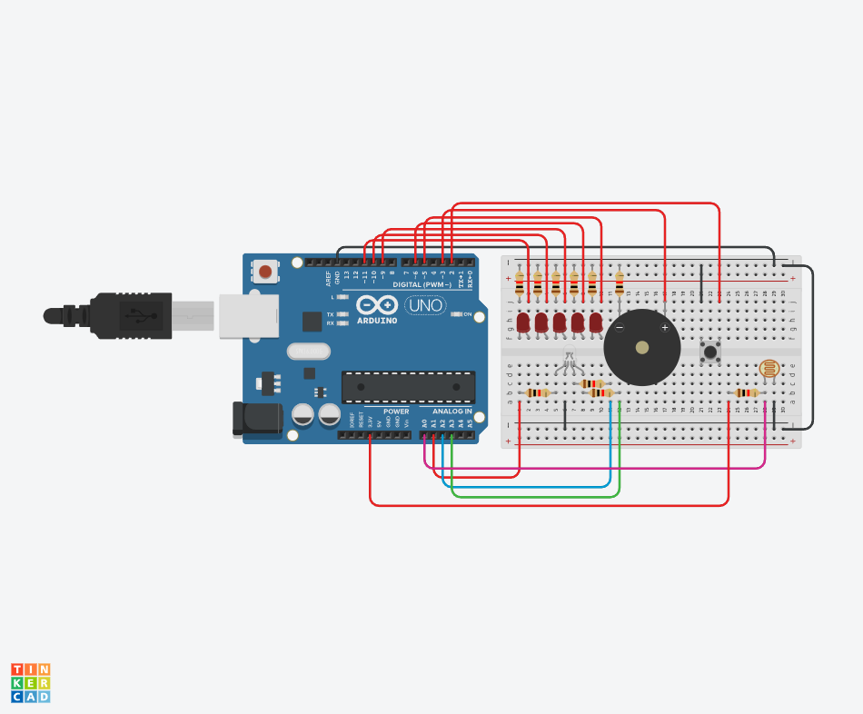

# クリスマスツリーのライトアップ

## システムの完成図

<table align=center>
  <tr>
    <td>
      
    </td>
  </tr>
</table>

## システムの概要

- クリスマスツリーのライトアップをイメージし、ボタンを押すと5つのLEDが光るパターンと、音が変化するような回路とプログラムを作成している。
- ライトアップのパターンは、LEDを光らせず音がないパターンと、LEDが交互に点滅し、シの音とレの音が2回ずつ鳴るパターンと、光が左右に交互に移動し、移動するごとにドレミファソラシドと音の周波数が上がったり、ドシラソファミレドと下がったりするパターンの3つを作成している。
- また、パターンごとにRGBLEDの色が変化する機能と、当たる光の量が少ないとライトアップの周期が早くなるようにする機能、当たる光の量を収集するPhotoresistorの電圧をSerialMonitorにより確認する機能を追加している。

(最終更新 2025/6/15)
